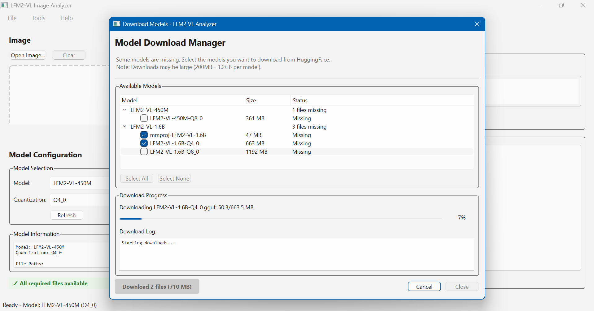

# LFM2-VL Image Analyzer

You can download it from: [fibogacci.com/download/LFM2-VL-Image-Analyzer-by-Fibogacci-v0.1.0.exe](fibogacci.com/download/LFM2-VL-Image-Analyzer-by-Fibogacci-v0.1.0.exe)

⚠️ **EARLY PROTOTYPE** - A Windows desktop application for analyzing images using LiquidAI's LFM2-VL vision models.

## ⚠️ Important Notice

This is an **early prototype** software. Please be aware:

- **May not work on all systems** - Particularly older hardware or certain Windows configurations
- **CPU Compatibility Issues** - Some older processors (Intel i7-4790 and similar) may experience crashes
- **Windows 10 vs 11** - Better stability on Windows 11, mixed results on Windows 10
- **Resource Intensive** - Requires significant RAM and CPU resources
- **Limited Support** - This is experimental software without warranty

## System Requirements

### Minimum Requirements
- **Windows 10/11** (64-bit) - Windows 11 preferred
- **8GB RAM** minimum (16GB+ recommended)
- **Modern CPU** - Intel Core i5-8xxx+ or AMD Ryzen 5 2xxx+ recommended
- **4GB free disk space**

### Known Problematic Hardware
- Intel i7-4790 (Haswell 2014) and older processors
- Systems with less than 8GB RAM
- Very old Windows 10 installations

## Features

- Image analysis using LiquidAI LFM2-VL vision-language models
- Support for LFM2-VL-450M (recommended) and LFM2-VL-1.6B models
- Multiple quantization options (Q4_0, Q8_0)
- Modern GUI built with PySide6
- Automatic CPU detection and optimization
- Customizable prompts and analysis parameters

## Quick Start

1. **Download** the latest `LFM2-VL-Analyzer.exe` from releases
2. **Download Models** from HuggingFace (see Model Setup below)
3. **Run** the executable - it will create necessary directories
4. **Configure** model paths in the application
5. **Test** with a simple image first

## Model Setup

You need to download GGUF models from HuggingFace:

### LFM2-VL-450M (Recommended - 354M parameters)
- **Main model**: [LiquidAI/LFM2-VL-450M-GGUF](https://huggingface.co/LiquidAI/LFM2-VL-450M-GGUF)
- **Required files**:
  - `LFM2-VL-450M-Q4_0.gguf` (219 MB) - fastest
  - `mmproj-LFM2-VL-450M-Q8_0.gguf` - vision projector
- **Memory**: ~1GB RAM required

### LFM2-VL-1.6B (Advanced - 1.17B parameters)
- **Main model**: [LiquidAI/LFM2-VL-1.6B-GGUF](https://huggingface.co/LiquidAI/LFM2-VL-1.6B-GGUF)
- **Required files**:
  - `LFM2-VL-1.6B-Q4_0.gguf` (696 MB)
  - `mmproj-LFM2-VL-1.6B-Q8_0.gguf` - vision projector
- **Memory**: ~2.5GB RAM required

### Model Placement
Place downloaded `.gguf` files in:
- **Bundled version**: `%APPDATA%\LFM2-VL-Analyzer\models\`
- **Development**: `./liquidai-lfm2-vl-models/`

## Architecture

This application uses an innovative **HTTP API approach**:
- Persistent `llama-server` process for stability
- HTTP requests instead of subprocess calls
- Eliminates Windows process creation stress
- Automatic CPU optimization and compatibility detection

## Troubleshooting

### Application Won't Start
- Ensure Windows Defender isn't blocking the executable
- Try running as Administrator
- Check Windows Event Viewer for crash details

### Server Crashes on Older CPUs
- The application automatically detects CPU capabilities
- Older processors get conservative "compatibility mode"
- If crashes persist, your CPU may be incompatible

### Out of Memory Errors
- Try the smaller LFM2-VL-450M model
- Close other applications to free RAM
- Reduce batch sizes in configuration

### General Issues
1. Check logs in `%APPDATA%\LFM2-VL-Analyzer\logs\`
2. Try the LFM2-VL-450M model first (lighter)
3. Ensure all required model files are downloaded
4. Restart the application if analysis gets stuck

## Configuration

Settings stored in:
- **Production**: `%APPDATA%\LFM2-VL-Analyzer\config.json`
- **Development**: `./lfm2_vl_analyzer/config.json`

## License

**Freeware** - Free for personal use. See `LICENSE` file for full terms.

- **Copyright**: Filip Bogacz (Fibogacci) 2025
- **Commercial use**: Prohibited without permission
- **Distribution**: GitHub releases only
- **Model licensing**: Users responsible for HuggingFace model compliance

## Development Status

- **Version**: v0.1.0 (Early Prototype)
- **Status**: Experimental, limited compatibility
- **Target**: Windows standalone distribution
- **Feedback**: Welcome via GitHub issues

## Contributing

This is experimental software. Bug reports and compatibility feedback are valuable:
1. Include your Windows version and CPU model
2. Attach log files from `%APPDATA%\LFM2-VL-Analyzer\logs\`
3. Specify which model you were using

## Contact

**Developer**: Filip Bogacz (Fibogacci)
- Website: https://fibogacci.com
- GitHub: https://github.com/Fibogacci
- LinkedIn: https://linkedin.com/in/Fibogacci

---

⚠️ **Disclaimer**: This software is provided "as-is" without warranty. Use at your own risk.
